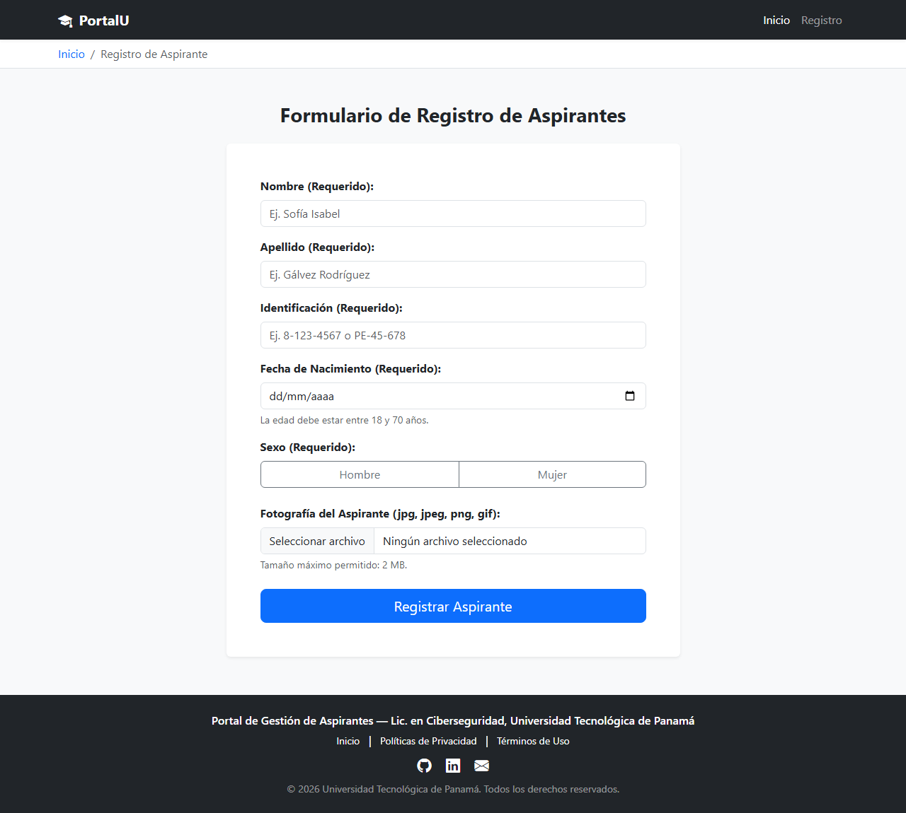
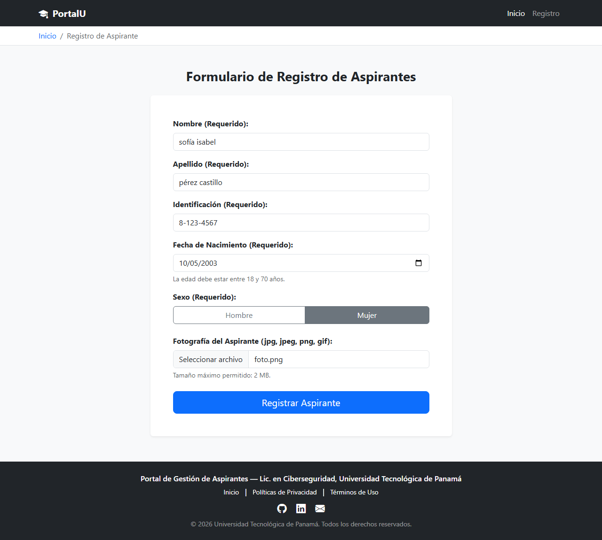
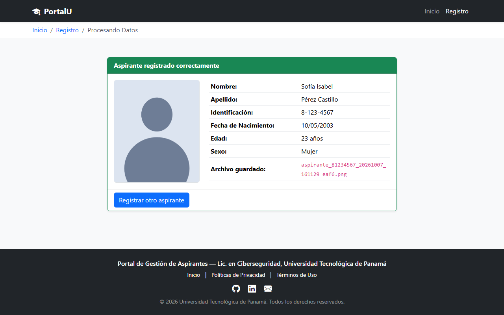
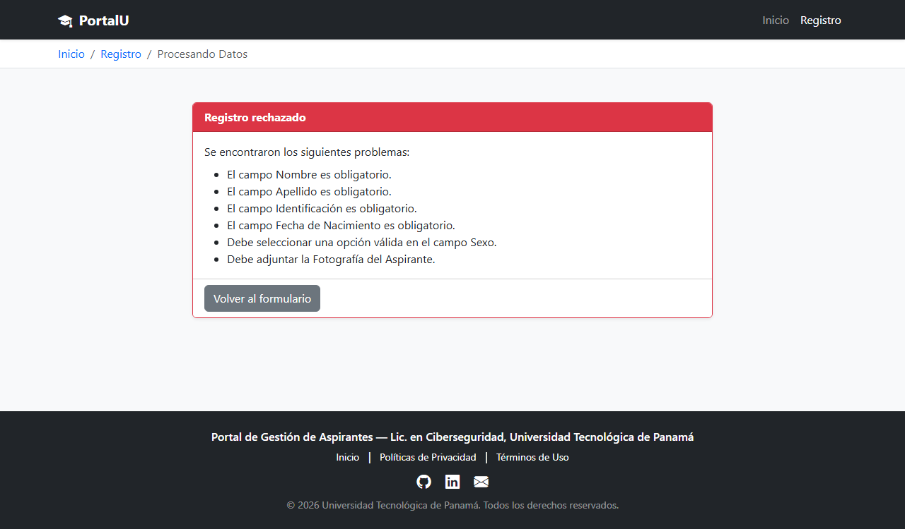
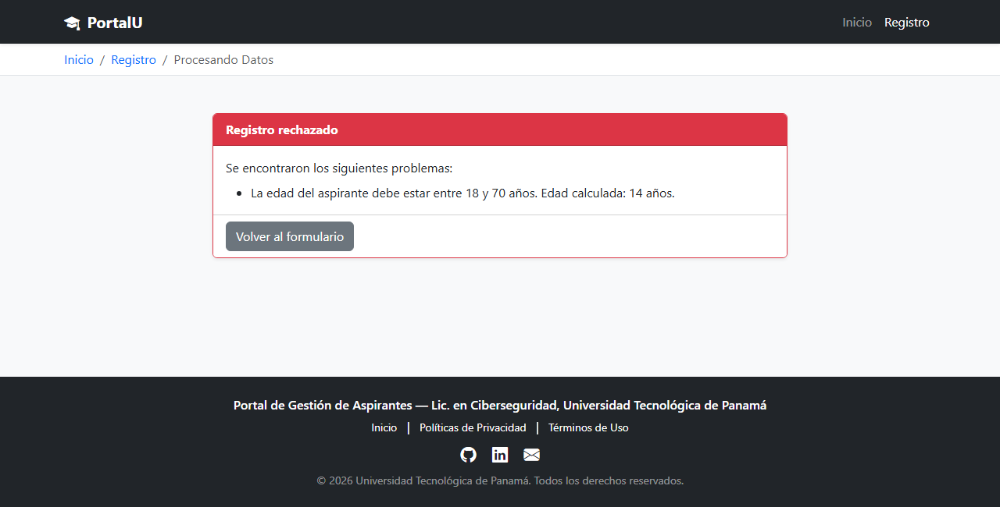
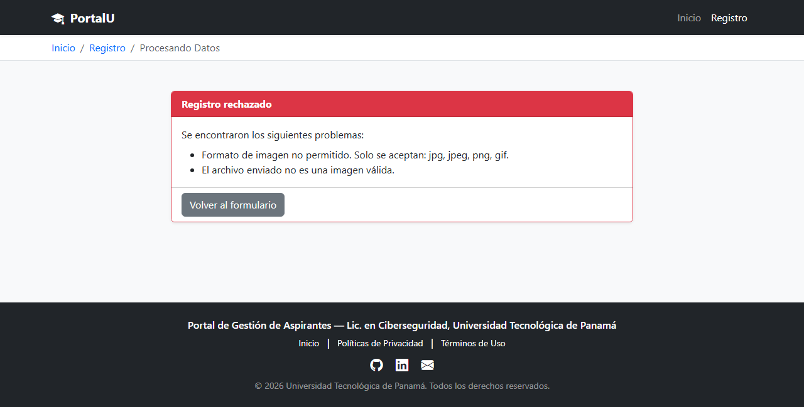
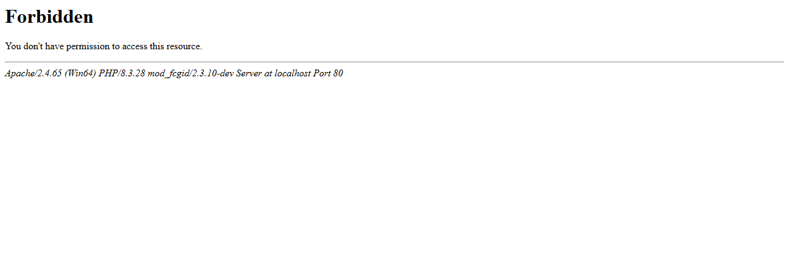

# Laboratorio #3 — Registro de Aspirantes

Sistema web de registro de aspirantes desarrollado con **HTML5, CSS3 (Bootstrap v5.3.8) y PHP**,
como parte del Módulo II (Diseño Web) y Módulo III (Programación de Aplicaciones Web).

- **Universidad:** Universidad Tecnológica de Panamá (UTP)
- **Profesora:** Ing. Irina Fong
- **Estudiante:** Angel Gálvez
- **Fecha de entrega:** 02 de octubre de 2026

---

## Descripción

Aplicación web que captura los datos de un aspirante (nombre, apellido, identificación,
fecha de nacimiento, sexo y fotografía), los valida en el backend con PHP, estandariza el
formato del texto y almacena la fotografía de forma segura en el servidor **sin usar base de datos**.

---

## Estructura de carpetas

```
Taller-Aspirantes/
│
├── capturas/           (Capturas de pantalla usadas como evidencia en este README)
│
├── includes/
│   ├── header.php      (Contiene el <header>, Navbar y Breadcrumb dinámico)
│   ├── footer.php      (Contiene el <footer> con enlaces y año dinámico)
│   └── formulario.php  (Contiene el formulario de registro)
│
├── uploaded_files/     (Carpeta donde se guardan las fotos subidas)
│   ├── .gitkeep        (Archivo oculto para que Git mantenga la carpeta vacía)
│   └── .htaccess       (Bloquea el acceso a la carpeta desde el navegador)
│
├── index.php           (Página principal con el formulario visual de registro)
├── procesar.php        (Backend que valida, procesa y muestra el resultado)
├── .gitignore
└── README.md
```

---

## Requisitos previos

- WampServer (Apache 2.4 + PHP 7.4 o superior)
- Extensión `mbstring` activa en PHP (viene activa por defecto en WampServer)
- `AllowOverride All` en el directorio `www` del `httpd.conf` para que el `.htaccess`
  surta efecto (es el valor por defecto de WampServer)
- Navegador web
- Visual Studio Code (recomendado)
- Conexión a internet (Bootstrap se carga desde CDN)

---

## Instalación y ejecución

1. Copiar la carpeta `Taller-Aspirantes` dentro de `C:\wamp64\www\`.
2. Iniciar WampServer y esperar a que el ícono esté en **verde**.
3. Abrir el navegador en: `http://localhost/Taller-Aspirantes/`
4. Llenar el formulario y presionar **Registrar Aspirante**.

Las fotografías quedan guardadas en `uploaded_files/` con un nombre generado por el sistema:
`aspirante_<identificacion>_<fecha_hora>_<aleatorio>.<extensión>`

---

## Funcionalidades implementadas

### Maquetación (HTML5 + Bootstrap)
- Etiquetas semánticas: `<header>`, `<main>`, `<section>`, `<footer>`.
- El formulario está dentro de `<main><section>`.
- Diseño responsivo con Bootstrap v5.3.8 y Bootstrap Icons.
- Metadatos: `charset`, `viewport`, `title`, `description`, `author`, `robots`, `theme-color`.

### Modularización con `include`
| Módulo | Archivo |
|---|---|
| Navegación (navbar + migas de pan) | `includes/header.php` |
| Formulario | `includes/formulario.php` |
| Footer | `includes/footer.php` |

El breadcrumb es **dinámico**: usa `basename($_SERVER['PHP_SELF'])` para detectar la página
actual y cambiar las migas de pan con una estructura `if / else`.

### Formulario
- Método `POST` con `enctype="multipart/form-data"`.
- Campos de tipo `text` (nombre, apellido, identificación), `date` (fecha de nacimiento),
  `radio` (sexo) y `file` (fotografía).
- Todos los campos son `required` y usan el atributo `placeholder`.
- El formulario lleva `novalidate` para que la validación de campos vacíos la haga
  **el servidor** (`procesar.php`) y se puedan ver sus mensajes de error.

### Validaciones en el backend (`procesar.php`)
| Validación | Implementación |
|---|---|
| Solo se acepta POST | `$_SERVER['REQUEST_METHOD']` |
| Campos no vacíos | Estructura `if` por cada campo |
| Edad entre 18 y 70 años | `DateTime::diff()` sobre la fecha de nacimiento |
| Sexo válido | `in_array()` con lista blanca |
| Extensión de imagen | `pathinfo()` + `in_array()` (jpg, jpeg, png, gif) |
| El archivo es una imagen real | `getimagesize()` |
| Tamaño máximo 2 MB | `$_FILES['foto']['size']` |

### Funciones de saneamiento y normalización
| Función | Uso |
|---|---|
| `htmlspecialchars()` | Previene XSS en toda la salida en pantalla (datos del aspirante y mensajes de error) |
| `strip_tags()` | Elimina etiquetas HTML/PHP de los campos de texto |
| `trim()` | Quita espacios al inicio y al final |
| `ucwords(strtolower())` | Formato Tipo Título en Nombre y Apellido ("sofia" → "Sofia"). Se aplica a través de la función `formatoTipoTitulo()`, que usa la versión multibyte (`mb_convert_case` + `mb_strtolower`) porque `ucwords`/`strtolower` trabajan byte a byte y rompen los acentos del español: `ucwords(strtolower("JOSÉ"))` devuelve `"JosÉ"` y `"NÚÑEZ"` devuelve `"NÚÑez"`. Con la versión multibyte se obtiene `"José"` y `"Núñez"`. Si `mbstring` no estuviera activa, la función cae de vuelta a `ucwords(strtolower())` |
| `strtoupper()` | Mayúsculas cerradas en la Identificación |
| `basename()` | Breadcrumb dinámico y neutralización de rutas en el nombre del archivo |

### Seguridad de la carpeta de fotos
La carpeta `uploaded_files/` **no puede ser accedida desde el navegador** gracias al archivo
`.htaccess` que contiene:
- `Require all denied` → devuelve **403 Forbidden** a cualquier petición directa.
- `php_flag engine off` → impide la ejecución de PHP dentro de la carpeta.
- `Options -Indexes` → impide el listado del directorio.

Además:
- El archivo **nunca conserva su nombre original**: `procesar.php` genera uno nuevo
  (`aspirante_<id>_<fechahora>_<aleatorio>`) y lo mueve con `move_uploaded_file()`.
  `basename()` neutraliza intentos de *path traversal* como `../../shell.jpg`.
- Si la carpeta llegara a faltar, `procesar.php` la recrea **y vuelve a escribir su
  `.htaccess`**, para que la protección nunca se pierda.
- La vista previa de la foto se genera en memoria con `base64` desde PHP, así la imagen
  se muestra en pantalla sin exponer la carpeta.
- Los módulos de `includes/` se redirigen al formulario si alguien los abre directamente
  en el navegador (comprobación con `basename()`), para no exponer HTML suelto.

---

## Pruebas sugeridas

| Prueba | Resultado esperado |
|---|---|
| Dejar un campo vacío | El servidor muestra "El campo ... es obligatorio" |
| Fecha que dé 17 o 71 años | Mensaje de error de rango de edad |
| Subir un archivo `.pdf`, `.txt` o `.webp` | Mensaje de formato no permitido |
| Escribir `sofia` en Nombre | Se guarda y muestra como `Sofia` |
| Escribir `<script>alert(1)</script>` | El texto se neutraliza, no se ejecuta |
| Abrir `http://localhost/Taller-Aspirantes/uploaded_files/` | **403 Forbidden** |
| Entrar directo a `procesar.php` | Redirige a `index.php` |

---

## Capturas de pantalla (evidencia)

### 1. Formulario de registro
Página principal (`index.php`) con la navegación, el formulario y el pie de página incluidos con `include`.



### 2. Formulario lleno
Los datos se escriben a propósito en minúsculas (`sofía isabel`, `pérez castillo`) para comprobar la estandarización.



### 3. Registro exitoso
`procesar.php` estandariza la salida (`Sofía Isabel`, `Pérez Castillo`), calcula la edad,
guarda la foto en `uploaded_files/` con un nombre nuevo y muestra el resultado.



### 4. Validación de campos vacíos (servidor)
Al enviar el formulario vacío, el servidor rechaza el registro e indica cada campo faltante.



### 5. Validación del rango de edad
Una fecha de nacimiento que da 14 años es rechazada (rango permitido: 18 a 70 años).



### 6. Validación de extensiones
Al subir un archivo `.pdf` se rechaza: solo se aceptan `jpg`, `jpeg`, `png` y `gif`.



### 7. Carpeta de fotos protegida
Al abrir `http://localhost/Taller-Aspirantes/uploaded_files/` Apache responde **403 Forbidden**
gracias al `.htaccess`.



---

## Tecnologías

HTML5 · CSS3 · Bootstrap v5.3.8 · Bootstrap Icons 1.11.3 · PHP · Apache (WampServer)

---

## Control de versiones

Todo el código fuente está publicado en GitHub:

**https://github.com/galvezangel074-glitch/Taller-Aspirantes**

Para clonarlo:

```bash
git clone https://github.com/galvezangel074-glitch/Taller-Aspirantes.git
```

El archivo `.gitignore` excluye las fotos subidas por los usuarios, pero conserva la
carpeta `uploaded_files/` gracias a `.gitkeep`, junto con su `.htaccess`.

---

## Autor

**Angel Gálvez**
Licenciatura en Ciberseguridad — Facultad de Ingeniería de Sistemas Computacionales
Universidad Tecnológica de Panamá (UTP)

Laboratorio #3 — Prof. Ing. Irina Fong — Entrega: 02 de octubre de 2026

---

## Licencia

Proyecto académico de uso educativo, elaborado para la Universidad Tecnológica de Panamá.
